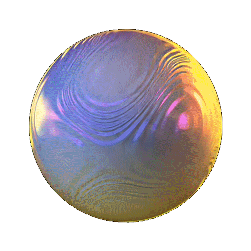

<h2> Hi, I'm Eric! </h2>

<p><em>Cloud Software Engineer at <a href="https://www.magazineluiza.com.br/">Luizalabs</a></em></p>
<p><em>Inconsistent Writer at <a href="https://medium.com/@ericpqmor">Medium</a></em></p>

[](https://twitter.com/ericpqmor)
[](https://www.linkedin.com/in/eric-moreira-4271b6232/)
[](https://github.com/eon-em)

###  A little more about me...  

```python
eric = {
  "pronouns": ["he", "they"],
  "interests": ["cloud computing", "information security"],
  "code": ["Python", "JavaScript", "Typescript", "Bash", "C", "C++", "C#", "Golang", "Cuda", "Lua", "Rust", "SQL", "Shell", "Matlab"],
  "tools": ["Node", "Docker", "Kubernetes", "AWS", "Terraform", "Openstack", "Jenkins", "Django", ".NET", "React", "Redux", "GraphQL", "React Native", "Cocos2D", "Unity"]
}
```


---
